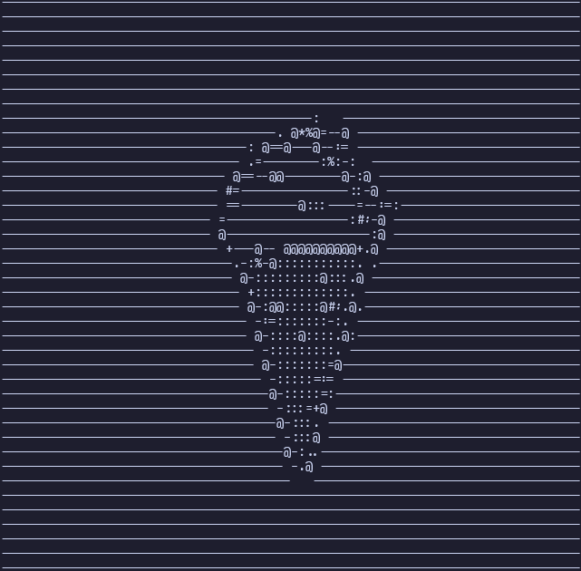

# BMP FILES PROJECT
simple cross-platform **c programs** that reads a 24-bit BMP image and inspect or manipulate them

read about the [BMP file format](https://en.wikipedia.org/wiki/BMP_file_format).

## Features
- Reads **24-bit BMP images**
- The **bmp_ascii.c** program converts BMP images to ascii text and print onto the terminal
- The **bmp_gray.c** program converts any BMP file to grayscale
- And the **main.c** program inspect and shows details like size, rgb array pixels and size of an image. all can be extended

#How to use

- First of all build and compile the file you want to run.
 e.g
 
 ```bash
 gcc main.c -o main
 ```
 for main.c

- Then run the program 
1. Grayscale conversion
    ```bash
    ./bmp_gray input.bmp output.bmp
    ```
2. BMP to Asci conversion
    ```bash 
    ./bmp_ascii test.bmp
    ```
# Demo
## ASCII


# Grayscale


Images source: [CONVERTICO](https://convertico.com/)

